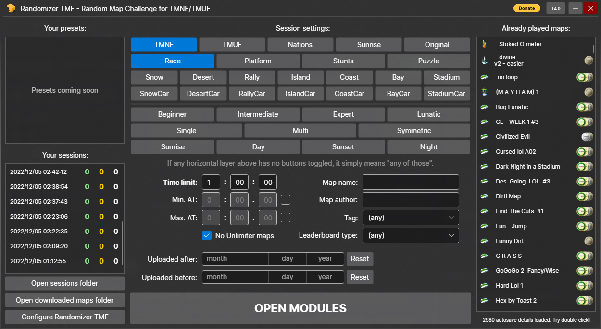
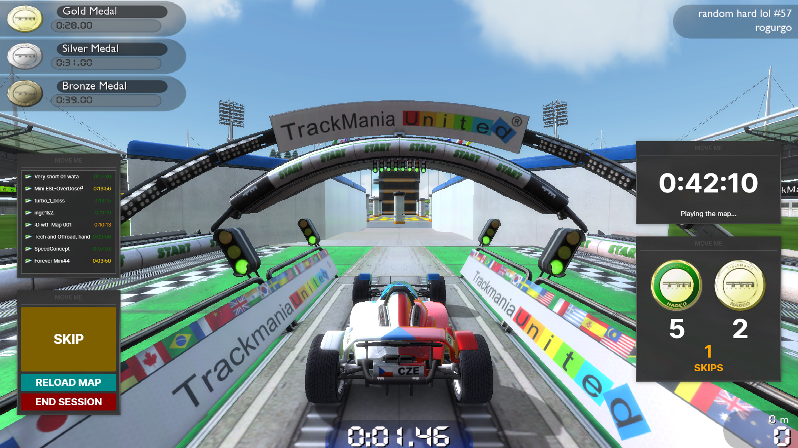

# Randomizer TMF (powered by [GBX.NET](https://github.com/BigBang1112/gbx-net))

**Randomizer TMF - Random Map Challenge for TMNF/TMUF** is a project (inspired from the Flink's Random Map Challenge) that ports random map picking experience to TMNF and TMUF games.

The project combines features of [TMX](https://tm-exchange.com/), autosave Gbx files with executable arguments to create flawless and automatic joy of exploration.

### You will never receive a map you finished before!

## [Installation](https://github.com/BigBang1112/randomizer-tmf/wiki/Installation)

## [QnA](https://github.com/BigBang1112/randomizer-tmf/wiki/QnA)

### Most common questions

#### [What is my installation directory?](https://github.com/BigBang1112/randomizer-tmf/wiki/QnA#what-is-my-installation-directory)
#### [Why I don't see the small windows/panels/modules above my game?](https://github.com/BigBang1112/randomizer-tmf/wiki/QnA#why-i-dont-see-the-small-windowspanelsmodules-above-my-game)
#### [Why my game changes its resolution when the map starts?](https://github.com/BigBang1112/randomizer-tmf/wiki/QnA#why-my-game-changes-its-resolution-when-the-map-starts-or-is-switched)
#### [Why is the timer running during map load?](https://github.com/BigBang1112/randomizer-tmf/wiki/QnA#why-is-the-timer-running-during-map-load)

## Features

- Race, Platform, Stunts, Puzzle gamemodes!
- TMNF, TMUF, Nations, Sunrise, Original TMX site randomization
- All kinds of TMX randomization filters supported by the site
  - Map name, author, environment, vehicle, tag, mood, difficulty, routes, leaderboard type, min. AT, max. AT, uploaded before, uploaded after, and many more hidden ones in Config.yml
- Filter Unlimiter maps!
- Custom time limit
- Preview of your autosaves

## Download goals

**50 downloads within 1 week** - Guaranteed support throughout 2023
**100 downloads** - Discord Rich Presence integration
**300 downloads** - TMUF theme
**500 downloads** - Profile management (fresh account randomization)
**2000 downloads** - Automated RMC leaderboards
**10000 downloads** - UI directly displayed ingame (fullscreen support)
**99999 downloads** - Randomizer TMTurbo

Gogo!

## Special thanks

To people that rooted the project:

- Flink and Greep (for inventing the challenge)
- Arkady (for inspiring this project with his `Open map` feature in [Gbx Map Browser](https://github.com/ArkadySK/GbxMapBrowser))

To all early testers:

- ajsasflaym
- Zai
- pekatour
- LinuxCat
- Poutrel
- Arkes

To all TMX maintainers that make this possible!

And to everyone still believing in me!